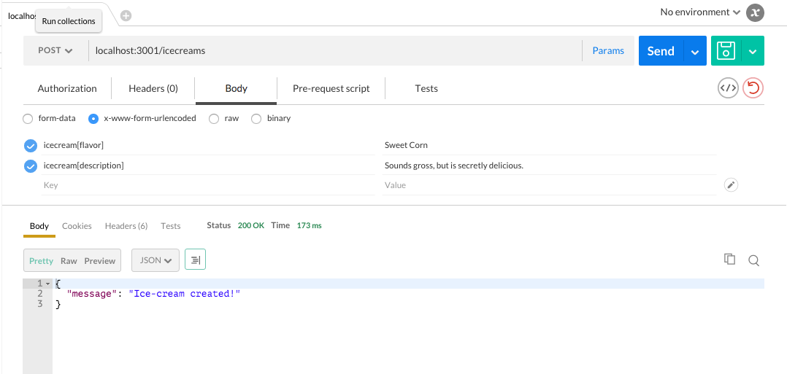

# Routing and Postman

Let's now work towards adding angular to the express app you built in the last section. In particular, we'll want to convert our apps into Single Page Apps. As a first step, we'll build a simple API to communicate with our database and respond with JSON. 

So that we can easily test our API routes, we'll first install Postman. Click the image link below to learn more about this tool.

[](https://www.getpostman.com/)

In the website click the 'get it now' button and add it to you Chrome browser.

## Routing

Since we will be relying on AngularJS to handle the views and the entire front end, our back end just needs to be a simple API. To create that API, we need to set up a router in our express app:

**server.js:**

```javascript
var apiRouter = express.Router();
```

What does `express.Router()` do? You know the drill: [check the docs](http://expressjs.com/guide/routing.html#express-router).

Let's start by refactoring our `index` and `post` routes for `/icecreams`. Using our new `apiRouter`, the code should look like this:

NEW *index* and *post* in **server.js:**

```javascript
apiRouter.route('/icecreams')
.get(function(req,res){
  db.Icecream.find({},function(error,response){
    res.json(response);
  });
})
.post(function(req,res){
  db.Icecream.create(req.body,function(error){
    if (error) return res.json({error:error.message});
    res.json({ message: 'Ice-cream created!' });
  });
});

app.use('/', apiRouter);
```

If you've set things up correctly, you should see that your views are no longer rendering. That's okay! For now, let's use postman to test our routes -- we'll return to our views when we add angular into the mix.

To test the routes that we created with our `apiRouter`, **postman** is the perfect tool for the job. It allows us to send the neccessay *post* and *get* requests to `localhost:3001/icecreams`.

Start up Postman, and do a **GET** request to `localhost:3001/icecreams`. You should see whatever data is in your ice cream database; if nothing is there yet, you should see `null` or an empty array.


Let's use Postman to add data to our database. Select **POST** in the drop down list next to the URL.  Select the "Body" tab, and select the "x-www-form-urlencoded" radio button. Finally fill out the key/values and send the post request.



Send another get request and you should see the ice-cream that was just created. You can also go to `localhost:3001/icecreams` to see the results of the index route.

For the next part, create another ice cream using Postman so that we can confirm the show route results that we're about to create.

**server.js:**

```javascript
apiRouter.route('/icecreams/:icecreamId')
.get(function(req,res){
  db.Icecream.findById(req.params.icecreamId,function(error,icecream){
    if (error) return res.json({message: "Sorry, there was an error finding that ice-cream!", error: error});
    res.json(icecream);
  })
})

```

**EXERCISE**

* How can we check to see if this route is working using Postman?

Add the rest of the routes for edit and delete,  **server.js:**

```javascript
apiRouter.route('/icecreams/:icecreamId')
.get(function(req,res){
  db.Icecream.findById(req.params.icecreamId,function(error,icecream){
    if (error) return res.json({message: "Sorry, there was an error finding that ice-cream!", error: error});
    res.json(icecream);
  });
})
.put(function(req,res){
  db.Icecream.findByIdAndUpdate(req.params.icecreamId, req.body, function(error,icecream){
    if (error) return res.json({message: "Sorry, there was an error!", error: error});
    if (icecream && !icecream.imageUrl) {
      icecream.imageUrl = "http://www.purpledooricecream.com/content/images/mystery-icecream_website(1).jpg";
      icecream.save();
    }
    res.json({ message: 'Ice-cream updated!' });
  });
})
.delete(function(req,res){
  db.Icecream.findById(req.params.icecreamId, function(error,icecream){
    if (error) return res.json({message: "Sorry, there was an error finding that ice-cream!", error: error});
    icecream.remove();
    res.json({ message: 'Ice-cream successfully deleted' });
  });
}); 
```

**EXERCISE**

* Test the edit and delete routes using Postman.
* Why do we use Postman?
